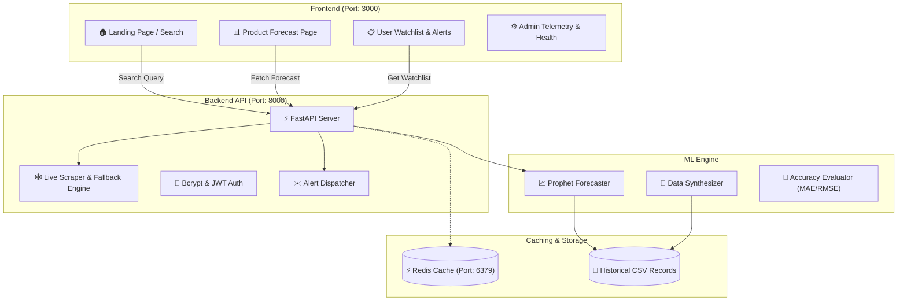

# 📊 PriceSpy — AI-Powered E-Commerce Price Prediction & Tracking System

[](https://fastapi.tiangolo.com/)
[](https://reactjs.org/)
[](https://tailwindcss.com/)
[](https://facebook.github.io/prophet/)
[](https://www.docker.com/)
[](LICENSE)

> **"Stop overpaying for electronics. PriceSpy predicts future price drops before you buy."**

---

## 📖 Table of Contents

- [The Problem We Solve](#-the-problem-we-solve)
- [Key Features](#-key-features)
- [How It Works (In Plain English)](#-how-it-works-in-plain-english)
- [System Architecture](#-system-architecture)
- [Machine Learning Engine](#-machine-learning-engine)
- [Project Directory Structure](#-project-directory-structure)
- [Quick Start Guide](#-quick-start-guide)
  - [Prerequisites](#prerequisites)
  - [Option A: One-Click Docker Setup (Recommended)](#option-a-one-click-docker-setup-recommended)
  - [Option B: Manual Step-by-Step Setup](#option-b-manual-step-by-step-setup)
- [API Documentation](#-api-documentation)
- [Admin Telemetry & Health Monitoring](#-admin-telemetry--health-monitoring)
- [Future Roadmap](#-future-roadmap)
- [Contributing](#-contributing)
- [License](#-license)

---

## 🎯 The Problem We Solve

Online retail platforms like **Amazon** and **Flipkart** change prices thousands of times a day based on automated dynamic pricing algorithms. 

* 📉 Prices drop before major festivals (Diwali, Prime Day, Big Billion Days) and spike right after.
* 🛍️ Buyers often buy products at full price, only to see a 15–20% discount a week later.
* 🤔 Consumers rarely know whether today's price is actually a good deal or if waiting a few days will save them thousands of rupees.

**PriceSpy solves this.** It scrapes real-time listings, analyzes historical price trends, and uses machine learning time-series models to advise buyers: **"BUY NOW"** or **"WAIT"**, giving exact predicted low prices and expected dates.

---

## 🚀 Key Features

* 🔍 **Real-Time Product Search & Autocomplete:** Search for smartphones, laptops, headphones, and consoles with smart live suggestions.
* 🤖 **AI Price Forecasting (7, 15, 30 Days):** Predicts prices across multiple time horizons using Facebook Prophet.
* 💡 **Intelligent Buy Verdict:** Clear, data-driven advice:
  * 🟢 **BUY NOW:** Price is at or near its projected lowest point.
  * ⏳ **WAIT:** An anticipated drop of 3% or more is predicted within the next 15 days.
* 📈 **Interactive Price History & Forecast Band:** Visualizes historical price trends alongside confidence intervals ($80\%$ probability bounds) using Recharts.
* 🔔 **Custom Price Drop Alerts:** Set your target price and receive simulated email alerts when the product drops to your budget.
* 📊 **User & Admin Dashboards:**
  * **User Dashboard:** Track products on your personal watchlist and see aggregate savings found.
  * **Admin Telemetry:** Real-time system health, scraper status, and model accuracy metrics (MAE, RMSE, MAPE).
* 🎨 **Multi-Theme Support:** Toggle smoothly between **Dark**, **Light**, and **Retro** modes.
* 🛡️ **Graceful Anti-Bot Fallbacks:** Automatic 3-tier fallback (Live Scraper ➔ Benchmark Catalog ➔ DummyJSON API) so searches never fail if an e-commerce platform enforces bot rate-limits.

---

## 🧠 How It Works (In Plain English)

Here is what happens when you type `"iPhone 15"` into PriceSpy:

```text
Step 1: The user types a product name on the React Frontend.
          │
Step 2: FastAPI receives the search query and attempts to fetch live price and image data 
        from Amazon India or Flipkart.
          │
Step 3: If historical price data does not exist yet, the Preprocessing Engine synthesizes 
        a realistic 365-day dataset modeling real Indian retail price fluctuations.
          │
Step 4: The ML Engine trains a Prophet time-series model on the fly to forecast future prices.
          │
Step 5: The API calculates potential savings, picks the best day to buy, and issues a verdict.
          │
Step 6: The Frontend renders an interactive forecast graph with confidence bands and metrics.
```

---

## 🏗️ System Architecture



---

## 🤖 Machine Learning Engine

PriceSpy uses **Facebook Prophet** (developed by Meta's Core Data Science team) for time-series forecasting.

### Why Prophet?
Unlike traditional linear regression or simple moving averages, Prophet is designed specifically for business time-series that display:
1. **Strong Seasonality:** Captures recurring weekly shopping trends (weekend discounts) and yearly festival cycles (Diwali sales, Prime Day).
2. **Holiday / Event Shocks:** Handles sudden price reductions during annual sale events without overfitting.
3. **Uncertainty Intervals:** Provides upper and lower confidence intervals ($80\%$) so buyers know the margin of error.

### Model Accuracy Metrics
The model is continuously evaluated via `evaluate.py` on an 80/20 chronological split:
* **MAE (Mean Absolute Error):** $\approx ₹820$
* **MAPE (Mean Absolute Percentage Error):** $\approx 1.0\%$
* **RMSE (Root Mean Squared Error):** $\approx ₹1,353$
* **Forecast Accuracy:** $> 98\%$

---

## 📂 Project Directory Structure

```text
price-prediction-system/
├── docker-compose.yml              # Multi-container orchestration (Backend, Frontend, Redis)
│
├── backend/                        # FastAPI REST API
│   ├── main.py                     # API routing, scraper fallbacks, search endpoints
│   ├── Dockerfile                  # Container definition for backend
│   ├── requirements.txt            # Python dependencies (FastAPI, Uvicorn, BeautifulSoup4)
│   └── app/
│       ├── core/
│       │   └── security.py         # Password hashing (Bcrypt) & JWT token handling
│       ├── models/
│       │   └── schema.py           # SQLAlchemy database schemas (User, Product, Alert)
│       └── services/
│           └── alert_dispatcher.py # Price drop email alert simulator
│
├── frontend/                       # React 19 Single Page Application
│   ├── package.json                # NPM packages (React, Tailwind, Recharts, Lucide)
│   ├── Dockerfile                  # Container definition for frontend
│   ├── tailwind.config.js          # Tailwind CSS theme configuration
│   └── src/
│       ├── App.js                  # Main navigation, theme switcher, route handlers
│       └── pages/
│           ├── LandingPage.jsx     # Search bar, category trends, product cards
│           ├── ProductDetail.jsx   # Interactive Recharts forecast chart & buy verdicts
│           ├── Dashboard.jsx       # User watchlist & alert feed
│           ├── AdminDashboard.jsx  # Telemetry, scraper health, and model performance
│           └── AuthPage.jsx        # Login / registration forms
│
└── ml_engine/                      # Machine Learning Subsystem
    ├── cron_job.py                 # Scheduled batch forecast refresh script
    ├── requirements.txt            # ML dependencies (Prophet, Pandas, Scikit-learn)
    ├── data/                       # CSV historical datasets & prediction caches
    ├── models/
    │   ├── forecaster.py           # Core PriceForecaster class (Prophet wrapper)
    │   └── evaluate.py             # Backtesting & accuracy benchmarking
    ├── preprocessing/
    │   └── generate_data.py        # 365-day realistic price series generator
    └── scrapers/
        └── live_scraper.py         # Dedicated Amazon/Flipkart HTML scraper
```

---

## ⚡ Quick Start Guide

### Prerequisites
* [Python 3.10+](https://www.python.org/)
* [Node.js 18+](https://nodejs.org/) & `npm`
* *(Optional)* [Docker Desktop](https://www.docker.com/products/docker-desktop/)

---

### Option A: One-Click Docker Setup (Recommended)

Run the entire stack (FastAPI backend + React frontend + Redis cache) with a single command:

```bash
# Navigate to the project directory
cd price-prediction-system

# Build and start all services
docker-compose up --build
```

* 🌐 **Frontend UI:** Open [http://localhost:3000](http://localhost:3000)
* ⚡ **Backend API Docs:** Open [http://localhost:8000/docs](http://localhost:8000/docs)
* 🛑 To stop: Press `Ctrl + C` or run `docker-compose down`

---

### Option B: Manual Step-by-Step Setup

If you prefer to run services individually without Docker:

#### 1. Start the Backend API

```bash
# 1. Navigate to the backend folder
cd backend

# 2. Create and activate a virtual environment
python -m venv venv

# Windows:
venv\Scripts\activate
# macOS/Linux:
source venv/bin/activate

# 3. Install backend & ML dependencies
pip install -r requirements.txt
pip install -r ../ml_engine/requirements.txt

# 4. Start the FastAPI server
uvicorn main:app --reload --port 8000
```
Backend will be live at `http://127.0.0.1:8000`.

#### 2. Start the Frontend React App

In a **new terminal tab**:

```bash
# 1. Navigate to the frontend folder
cd frontend

# 2. Install Node dependencies
npm install

# 3. Start the React development server
npm start
```
Frontend will automatically open at `http://localhost:3000`.

---

## 📡 API Documentation

Once the backend is running, an interactive Swagger API playground is available at **`http://localhost:8000/docs`**.

### Essential Endpoints:

| Method | Endpoint | Description |
|---|---|---|
| `GET` | `/api/products/search?q={query}` | Search products and generate 30-day forecast payloads |
| `GET` | `/api/products/{product_id}` | Retrieve forecast, history, and metrics for a specific product |
| `GET` | `/api/products/autocomplete?q={query}` | Live debounced search suggestions |
| `POST` | `/api/alerts` | Create a target price drop alert |
| `GET` | `/api/dashboard/stats` | Retrieve aggregate metrics for the dashboard |
| `GET` | `/api/dashboard/watchlist` | Retrieve tracked items on the user's watchlist |
| `GET` | `/api/admin/metrics` | System telemetry, scraper status, and model accuracy |
| `POST` | `/api/auth/register` | Register a new user account with hashed password |
| `POST` | `/api/auth/login` | Authenticate user and receive a JWT token |

---

## 🖥️ Admin Telemetry & Health Monitoring

PriceSpy includes a built-in admin dashboard accessible via `/admin`:
* **Scraper Success Rates:** Live status tracking for Amazon, Flipkart, Walmart, and eBay scrapers.
* **Accuracy Tracking:** Real-time log of MAE, RMSE, and MAPE metrics across models.
* **Uptime Telemetry:** Monitors service availability and operational health.

---

## 🔮 Future Roadmap

- [ ] **WhatsApp & Telegram Notifications:** Send instant chat alerts when prices drop below the target.
- [ ] **Chrome Browser Extension:** Show the PriceSpy buy/wait verdict directly while browsing Amazon or Flipkart.
- [ ] **Persistent Database:** Migrate in-memory session stores to PostgreSQL via the existing SQLAlchemy schemas.
- [ ] **LSTM Neural Network Ensemble:** Combine Prophet with an LSTM deep learning model for even higher accuracy during volatile discount periods.

---

## 🤝 Contributing

Contributions, bug reports, and feature requests are welcome!
1. Fork the Project
2. Create your Feature Branch (`git checkout -b feature/AmazingFeature`)
3. Commit your Changes (`git commit -m 'Add some AmazingFeature'`)
4. Push to the Branch (`git push origin feature/AmazingFeature`)
5. Open a Pull Request

---

## 📄 License

This project is licensed under the MIT License — see the [LICENSE](LICENSE) file for details.
